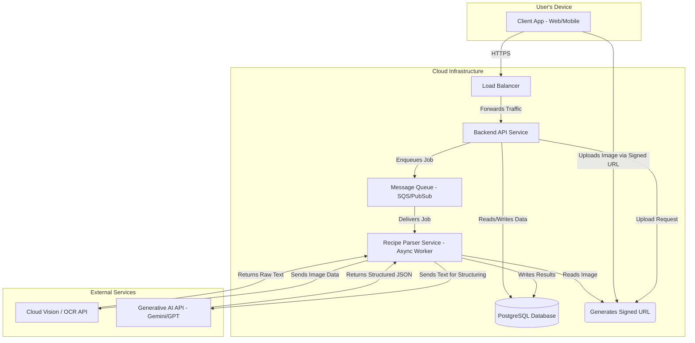
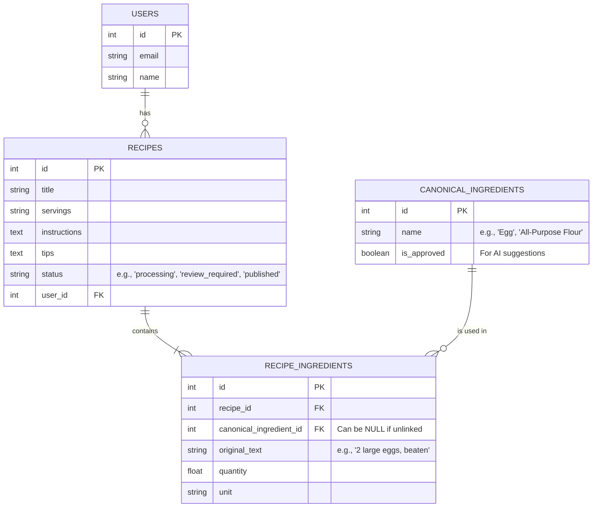

# Architectural Decision Record (ADR): AI-Powered Recipe Hub MVP

**Document Status:** Final v1.0
**Author:** AI-Architect
**Date:** August 28, 2025

This document outlines the key architectural decisions for the Minimum Viable Product (MVP) of the AI-Powered Recipe Hub, based on the v1.0 PRD. The guiding principle is to prioritize simplicity, reliability, and maintainability, enabling rapid delivery of the core feature set while allowing for future scalability.

---

## 1. High-Level System Design: Decoupled Services

We will adopt a decoupled architecture consisting of two primary services: a **Backend API Service** and a **Recipe Parser Service**.

* **Decision:** Instead of a single monolithic application, the core user-facing API will be separate from the resource-intensive AI processing logic. Communication between them will be managed asynchronously via a message queue.
* **Rationale:**
    * **Performance:** Long-running AI tasks in the parser service will not block or slow down the user-facing API. This ensures the user experience remains fast and responsive.
    * **Scalability:** Each service can be scaled independently. If recipe parsing becomes a bottleneck, we can increase the number of parser workers without touching the API service.
    * **Resilience:** An issue or crash in the parser service will not bring down the main application. Failed jobs can be retried without user impact.

### Architecture Diagram

## 2.Technology Stack & Components

### Backend API Service

* **Technology**: Go with the Gin framework.
* **Rationale**: Chosen for its high performance, low memory footprint, excellent concurrency support, and creation of small, efficient container images.
* **Trade-off**: Node.js with TypeScript could offer faster initial development, but Go provides superior performance and maintainability for this use case.

### Recipe Parser Service

* **Technology**: Python (e.g., using FastAPI or Flask).
* **Rationale**: Python is the undisputed standard for AI/ML tasks. This choice provides immediate access to the best libraries and SDKs for interacting with external AI services. There is no practical trade-off.

### Database

* **Technology**: PostgreSQL.
* **Rationale**: The application's data is fundamentally relational (recipes, ingredients, user links). PostgreSQL offers strong transactional integrity and is the most reliable and simple choice for modeling these relationships.
* **Trade-off**: A NoSQL database would add unnecessary complexity at the application layer to manage relationships that a relational database handles natively.

## 3. Core AI Workflow: Image-to-Data Pipeline
The conversion of a recipe image into structured data will be a two-step process.

* **Decision**: We will first use a specialized Optical Character Recognition (OCR) service to extract raw text, and then feed that text into a text-based Large Language Model (LLM) for structuring.
* **Rationale**:
    * **Reliability**: Uses the best tool for each part of the job—a specialized OCR for transcription and a text LLM for language understanding.
    * **Cost**: This approach is significantly more cost-effective. OCR APIs are commoditized, while multimodal image analysis in LLMs is a premium, more expensive feature.
    * **Debuggability**: A two-step process makes it trivial to identify the point of failure. We can inspect the OCR output before it ever reaches the LLM.

## 4. Data Model
The data model will be relational to enforce structure and integrity from day one.

* **Decision**: We will use distinct tables for Recipes, Canonical_Ingredients, and a joining table Recipe_Ingredients to link them. This directly supports the core feature of reviewing and linking ingredients.
* **Rationale**: This design is the most direct and efficient way to meet the PRD's requirement for a structured and editable ingredient list.

### Database Schema

