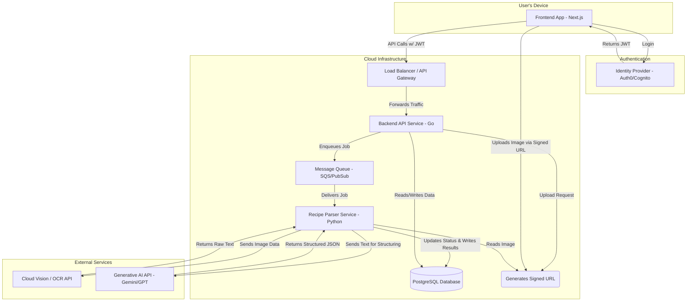

# Architectural Decision Record (ADR): AI-Powered Recipe Hub MVP

**Document Status:** Final v1.1
**Author:** AI-Architect
**Date:** August 29, 2025

This document outlines the key architectural decisions for the Minimum Viable Product (MVP) of the AI-Powered Recipe Hub, based on the v1.0 PRD. The guiding principle is to prioritize simplicity, reliability, and maintainability, enabling rapid delivery of the core feature set while allowing for future scalability.

---

## 1. High-Level System Design

The system will be composed of three primary, decoupled components: a **Frontend Application**, a **Backend API Service**, and a **Recipe Parser Service**. This separation of concerns ensures the user-facing application remains responsive, as long-running AI tasks are handled asynchronously by a dedicated worker service.

* **Rationale**:
    * **Performance**: Isolating the AI processing prevents it from blocking or slowing down the core user API.
    * **Scalability**: The Frontend, API, and Parser can each be scaled independently based on their specific loads.
    * **Resilience**: A failure in the AI parsing service will not crash the main application; jobs can be retried without user impact.

### Architecture Diagram



---

## 2. Frontend Application

* **Technology**: **React** with the **Next.js** framework.
* **Rationale**: We've chosen this stack for its vast ecosystem, excellent developer experience, and performance features like Server-Side Rendering (SSR), which ensures a fast initial page load. It can be easily deployed to modern cloud platforms like Vercel or AWS Amplify.
* **Trade-off**: While other frameworks could produce a marginally smaller final bundle, the productivity gains and large talent pool available for the React ecosystem provide more value for our MVP timeline.

---

## 3. Backend Services

### 3.1. Backend API Service

* **Technology**: **Go** with the **Gin** framework.
* **Rationale**: Go is chosen for its high performance, low memory footprint, and first-class support for concurrency, which is ideal for an I/O-bound API service. It produces small, efficient container images.

### 3.2. Recipe Parser Service

* **Technology**: **Python**.
* **Rationale**: Python is the undisputed standard for AI/ML tasks. This choice provides immediate access to the best libraries and SDKs for interacting with the external OCR and LLM services we will depend on.

---

## 4. Authentication & Authorization

* **Decision**: We will use a managed third-party identity provider, such as **Auth0** or **AWS Cognito**, to handle all user authentication.
* **Workflow**: The frontend application will manage the sign-up and login flows with the identity provider. Upon successful login, the provider will issue a **JSON Web Token (JWT)** to the client. This JWT must be included in the `Authorization` header of all subsequent API requests. The Backend API will be responsible for validating this token on every protected endpoint.
* **Rationale**: Building a secure and robust authentication system is complex. Offloading this responsibility to a specialized service accelerates development, enhances security, and simplifies the future addition of features like social logins.

---

## 5. API Contracts

Communication between the frontend and backend will be handled via a stateless **RESTful API** using JSON. This is an industry-standard approach that is well-understood and widely supported.

### High-Level Endpoints:

* `POST /v1/recipes/upload-request`:
    * **Purpose**: To initiate the creation of a new recipe.
    * **Action**: Creates a `RECIPE` record with `status: 'processing'` and returns pre-signed URLs that allow the client to upload images directly and securely to object storage.
    * **Response**: `{ "recipe_id": "...", "upload_urls": ["..."] }`
* `GET /v1/recipes`:
    * **Purpose**: To fetch the list of all recipes for the authenticated user.
    * **Response**: `[{ "id": "...", "title": "...", "status": "published" }, ...]`
* `GET /v1/recipes/{recipe_id}`:
    * **Purpose**: To fetch the full details of a single recipe. The frontend will use this endpoint to poll for the status of a recipe that is being processed.
    * **Response**: The full recipe JSON object, including its current `status` field.
* `PUT /v1/recipes/{recipe_id}`:
    * **Purpose**: To save the user's edits from the "Review & Edit" screen.
    * **Action**: Updates the recipe and its ingredients and sets the `status` to `'published'`.
* `GET /v1/ingredients/search?q={query}`:
    * **Purpose**: To power the UI feature that allows users to re-link an ingredient to a different canonical ingredient.
    * **Response**: A list of matching canonical ingredients.

---

## 6. Data & AI Tier

### 6.1. Database

* **Technology**: **PostgreSQL**.
* **Rationale**: The application's data is fundamentally relational (users have recipes, which have ingredients). PostgreSQL offers strong transactional integrity and is the simplest, most reliable choice for modeling these relationships directly in the database.

### 6.2. AI Workflow: Image-to-Data Pipeline

* **Decision**: We will use a two-step process. First, a specialized **Optical Character Recognition (OCR)** service will extract raw text from the images. Second, this text will be passed to a **Large Language Model (LLM)** for structuring into the final JSON format.
* **Rationale**: This approach is more reliable, cost-effective, and easier to debug than using a single, more expensive multimodal model. We can inspect the intermediate OCR output to isolate issues quickly.

### 6.3. Database Schema

```mermaid
erDiagram
    USERS {
        int id PK
        string email
        string name
    }

    RECIPES {
        int id PK
        string title
        string servings
        text instructions
        text tips
        string status "e.g., 'processing', 'review_required', 'published', 'failed'"
        int user_id FK
    }

    CANONICAL_INGREDIENTS {
        int id PK
        string name "e.g., 'Egg', 'All-Purpose Flour'"
        boolean is_approved "For AI suggestions"
    }

    RECIPE_INGREDIENTS {
        int id PK
        int recipe_id FK
        int canonical_ingredient_id FK "Can be NULL if unlinked"
        string original_text "e.g., '2 large eggs, beaten'"
        float quantity
        string unit
    }

    USERS ||--o{ RECIPES : "has"
    RECIPES ||--|{ RECIPE_INGREDIENTS : "contains"
    CANONICAL_INGREDIENTS ||--o{ RECIPE_INGREDIENTS : "is used in"
}
```