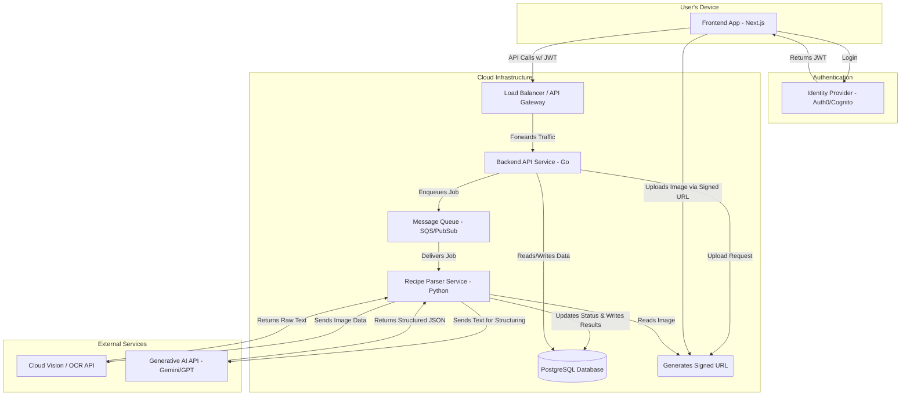

# Architectural Decision Record (ADR): AI-Powered Recipe Hub MVP

**Document Status:** Final v1.1
**Author:** AI-Architect
**Date:** August 29, 2025

This document outlines the key architectural decisions for the Minimum Viable Product (MVP) of the AI-Powered Recipe Hub, based on the v1.0 PRD. The guiding principle is to prioritize simplicity, reliability, and maintainability, enabling rapid delivery of the core feature set while allowing for future scalability.

---

## 1. High-Level System Design

The system will be composed of three primary, decoupled components: a **Frontend Application**, a **Backend API Service**, and a **Recipe Parser Service**. This separation of concerns ensures the user-facing application remains responsive, as long-running AI tasks are handled asynchronously by a dedicated worker service.

* **Rationale**:
    * **Performance**: Isolating the AI processing prevents it from blocking or slowing down the core user API.
    * **Scalability**: The Frontend, API, and Parser can each be scaled independently based on their specific loads.
    * **Resilience**: A failure in the AI parsing service will not crash the main application; jobs can be retried without user impact.

### Architecture Diagram

```mermaid
graph TD
    subgraph User's Device
        Frontend[Frontend App - Next.js]
    end

    subgraph Authentication
        IdP[Identity Provider - Auth0/Cognito]
    end

    subgraph Cloud Infrastructure
        LB[Load Balancer / API Gateway]
        API[Backend API Service - Go]
        Parser[Recipe Parser Service - Python]
        DB[(PostgreSQL Database)]
        Store[Object Storage - S3/GCS]
        Queue[Message Queue - SQS/PubSub]
    end

    subgraph External Services
        OCR[Cloud Vision / OCR API]
        LLM[Generative AI API - Gemini/GPT]
    end

    Frontend -- Login --> IdP
    IdP -- Returns JWT --> Frontend
    Frontend -- API Calls w/ JWT --> LB
    LB -- Forwards Traffic --> API

    API -- Upload Request --> Store(Generates Signed URL)
    Frontend -- Uploads Image via Signed URL --> Store

    API -- Enqueues Job --> Queue
    Queue -- Delivers Job --> Parser

    Parser -- Reads Image --> Store
    Parser -- Sends Image Data --> OCR
    OCR -- Returns Raw Text --> Parser
    Parser -- Sends Text for Structuring --> LLM
    LLM -- Returns Structured JSON --> Parser

    Parser -- Updates Status & Writes Results --> DB
    API -- Reads/Writes Data --> DB
```

---

## 2. Frontend Application

* **Technology**: **React** with the **Next.js** framework.
* **Rationale**: We've chosen this stack for its vast ecosystem, excellent developer experience, and performance features like Server-Side Rendering (SSR), which ensures a fast initial page load. It can be easily deployed to modern cloud platforms like Vercel or AWS Amplify.
* **Trade-off**: While other frameworks could produce a marginally smaller final bundle, the productivity gains and large talent pool available for the React ecosystem provide more value for our MVP timeline.

---

## 3. Backend Services

### 3.1. Backend API Service

* **Technology**: **Go** with the **Gin** framework.
* **Rationale**: Go is chosen for its high performance, low memory footprint, and first-class support for concurrency, which is ideal for an I/O-bound API service. It produces small, efficient container images.

### 3.2. Recipe Parser Service

* **Technology**: **Python**.
* **Rationale**: Python is the undisputed standard for AI/ML tasks. This choice provides immediate access to the best libraries and SDKs for interacting with the external OCR and LLM services we will depend on.

---

## 4. Authentication & Authorization

* **Decision**: We will use a managed third-party identity provider, such as **Auth0** or **AWS Cognito**, to handle all user authentication.
* **Workflow**: The frontend application will manage the sign-up and login flows with the identity provider. Upon successful login, the provider will issue a **JSON Web Token (JWT)** to the client. This JWT must be included in the `Authorization` header of all subsequent API requests. The Backend API will be responsible for validating this token on every protected endpoint.
* **Rationale**: Building a secure and robust authentication system is complex. Offloading this responsibility to a specialized service accelerates development, enhances security, and simplifies the future addition of features like social logins.

---

## 5. API Contracts

Communication between the frontend and backend will be handled via a stateless **RESTful API** using JSON. This is an industry-standard approach that is well-understood and widely supported.

### High-Level Endpoints:

* `POST /v1/recipes/upload-request`:
    * **Purpose**: To initiate the creation of a new recipe.
    * **Action**: Creates a `RECIPE` record with `status: 'processing'` and returns pre-signed URLs that allow the client to upload images directly and securely to object storage.
    * **Response**: `{ "recipe_id": "...", "upload_urls": ["..."] }`
* `GET /v1/recipes`:
    * **Purpose**: To fetch the list of all recipes for the authenticated user.
    * **Response**: `[{ "id": "...", "title": "...", "status": "published" }, ...]`
* `GET /v1/recipes/{recipe_id}`:
    * **Purpose**: To fetch the full details of a single recipe. The frontend will use this endpoint to poll for the status of a recipe that is being processed.
    * **Response**: The full recipe JSON object, including its current `status` field.
* `PUT /v1/recipes/{recipe_id}`:
    * **Purpose**: To save the user's edits from the "Review & Edit" screen.
    * **Action**: Updates the recipe and its ingredients and sets the `status` to `'published'`.
* `GET /v1/ingredients/search?q={query}`:
    * **Purpose**: To power the UI feature that allows users to search and link ingredients to existing ones in their collection.
    * **Response**: A list of matching ingredients from the user's existing ingredient collection.
* `PUT /v1/recipes/{recipe_id}/ingredients/{ingredient_id}/link`:
    * **Purpose**: To link an ingredient to an existing ingredient in the user's collection.
    * **Action**: Creates the connection between recipe ingredient and existing ingredient.
* `POST /v1/ingredients`:
    * **Purpose**: To create a new canonical ingredient in the user's collection.
    * **Action**: Creates new canonical ingredient with user_id scope.
* `GET /v1/ingredients/manage`:
    * **Purpose**: To retrieve all user's canonical ingredients with usage statistics.
    * **Response**: List of canonical ingredients with recipe usage counts.
* `PUT /v1/ingredients/{ingredient_id}/merge`:
    * **Purpose**: To merge two canonical ingredients into one.
    * **Action**: Updates all recipe links to target ingredient, deletes source ingredient.
* `PUT /v1/ingredients/{ingredient_id}`:
    * **Purpose**: To rename a canonical ingredient.
    * **Action**: Updates the ingredient name across all linked recipes.
* `DELETE /v1/ingredients/{ingredient_id}`:
    * **Purpose**: To delete an unused canonical ingredient.
    * **Action**: Removes canonical ingredient if not used in any recipes.

---

## 6. Data & AI Tier

### 6.1. Database

* **Technology**: **PostgreSQL**.
* **Rationale**: The application's data is fundamentally relational (users have recipes, which have ingredients). PostgreSQL offers strong transactional integrity and is the simplest, most reliable choice for modeling these relationships directly in the database.

### 6.2. AI Workflow: Image-to-Data Pipeline

* **Decision**: We will use a two-step process. First, a specialized **Optical Character Recognition (OCR)** service will extract raw text from the images. Second, this text will be passed to a **Large Language Model (LLM)** for structuring into the final JSON format.
* **Rationale**: This approach is more reliable, cost-effective, and easier to debug than using a single, more expensive multimodal model. We can inspect the intermediate OCR output to isolate issues quickly.

### 6.3. Database Schema

```mermaid
erDiagram
    USERS {
        int id PK
        string email
        string name
    }

    RECIPES {
        int id PK
        string title
        string servings
        text instructions
        text tips
        string status "e.g., 'processing', 'review_required', 'published', 'failed'"
        int user_id FK
    }

    CANONICAL_INGREDIENTS {
        int id PK
        string name "e.g., 'Egg', 'All-Purpose Flour'"
        boolean is_approved "For AI suggestions"
        int user_id FK "Scoped to user's ingredient collection"
    }

    RECIPE_INGREDIENTS {
        int id PK
        int recipe_id FK
        int canonical_ingredient_id FK "NULL = 'New Ingredient', NOT NULL = 'Linked to Existing'"
        string original_text "e.g., '2 large eggs, beaten'"
        float quantity
        string unit
    }

    USERS ||--o{ RECIPES : "has"
    USERS ||--o{ CANONICAL_INGREDIENTS : "owns ingredient collection"
    RECIPES ||--|{ RECIPE_INGREDIENTS : "contains"
    CANONICAL_INGREDIENTS ||--o{ RECIPE_INGREDIENTS : "is used in"
}
```

### 6.4. Ingredient Management Philosophy

* **User-Centered Design**: The ingredient system is designed around a mandatory resolution workflow: "Before publishing, all ingredients must be linked to canonical ingredients."

* **Review-to-Publish Workflow**: Recipe ingredients follow a strict lifecycle:
    * **During Review**: `canonical_ingredient_id` can be NULL (unresolved)
    * **Before Publishing**: ALL ingredients must have `canonical_ingredient_id` set
    * **After Publishing**: No NULL values allowed - ensures data consistency

* **Application-Level Validation**: Since PostgreSQL doesn't allow subqueries in CHECK constraints, the constraint is enforced at the application level:
    - Recipe publishing endpoints validate that all ingredients have `canonical_ingredient_id` set
    - Frontend prevents publishing until all ingredients are resolved
    - Database integrity maintained through application logic

* **User-Scoped Collections**: Each user has their own ingredient collection (`CANONICAL_INGREDIENTS.user_id`). This ensures:
    * Users only see ingredients from their own recipes when searching to link
    * No cross-user data contamination
    * Each user builds their personal ingredient vocabulary over time

* **AI Assistance**: The system attempts to automatically link ingredients when recipes are processed:
    * **Auto-Link**: AI links ingredients to existing canonical ingredients where confidence is high
    * **User Resolution**: Users must resolve unlinked ingredients before publishing
    * **Create New**: Users can create new canonical ingredients during resolution

* **Ingredient Management**: Users can maintain their ingredient collection over time:
    * **Merge Duplicates**: Combine duplicate canonical ingredients and update all recipe links
    * **Delete Unused**: Remove canonical ingredients not used in any recipes
    * **Rename**: Update canonical ingredient names across all linked recipes

* **Data Quality Benefits**: This approach ensures:
    * All published recipes have fully linked ingredients
    * Shopping lists and analytics features work reliably
    * Long-term data consistency and quality
    * User control over their ingredient vocabulary